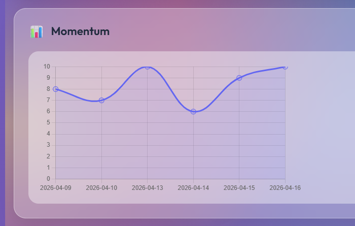

# Momentum Tracker 📊

A simple app I built to track my daily momentum and visualize progress over time.

## 🚀 Overview
This project helps track daily activity and convert it into a momentum score, making it easier to stay consistent and identify patterns.

## 📈 Sample Output

## 💡 Key Insight
Progress isn’t linear. There are dips — but consistency is about recovering quickly and continuing forward.

## 🛠️ Tech Stack
- HTML (structure)
- CSS (styling and layout)
- JavaScript (data tracking and momentum calculation)

## 🔄 Future Improvements
- Add data persistence (save progress)
- Improve analytics and insights
- Enhance UI/UX

## 🤝 Feedback
Open to suggestions and improvements!
